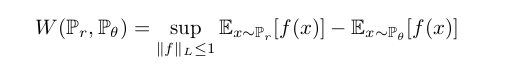
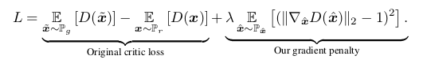

# DCGAN
模型结构上需要做如下几点变化：

* 将pooling层convolutions替代，其中，在discriminator上用strided convolutions替代，在generator上用fractional-strided convolutions替代.  
* 在generator和discriminator上都使用batchnorm。 
	* 解决初始化差的问题
	* 帮助梯度传播到每一层
	* 防止generator把所有的样本都收敛到同一个点。
	* 直接将BN应用到所有层会导致样本震荡和模型不稳定，通过在generator输出层和discriminator输入层不采用BN可以防止这种现象。
* 移除全连接层 
	* global pooling增加了模型的稳定性，但伤害了收敛速度。
* 在generator的除了输出层外的所有层使用ReLU，输出层采用tanh。
* 在discriminator的所有层上使用LeakyReLU。 

# GAN
__wgan 优化__

__wgan-gp优化__

| 博客 | 地址 |
| :--: | :--: |
|令人拍案叫绝的Wasserstein GAN|<https://zhuanlan.zhihu.com/p/25071913>|
|Wasserstein GAN|<https://blog.csdn.net/shadow_guo/article/details/56003908>|
|W-GAN系 (Wasserstein GAN、 Improved WGAN)|<https://www.cnblogs.com/king-lps/p/8480267.html>|

